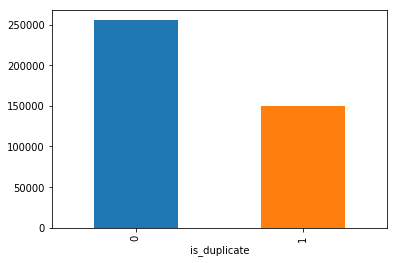
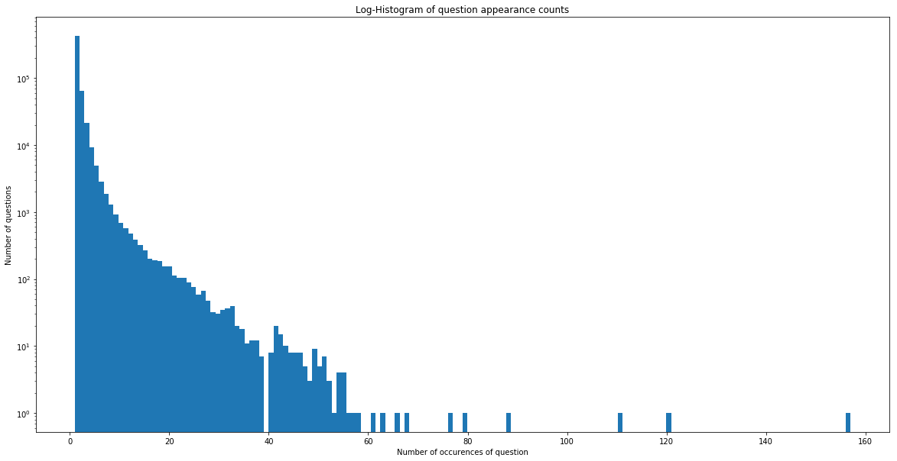
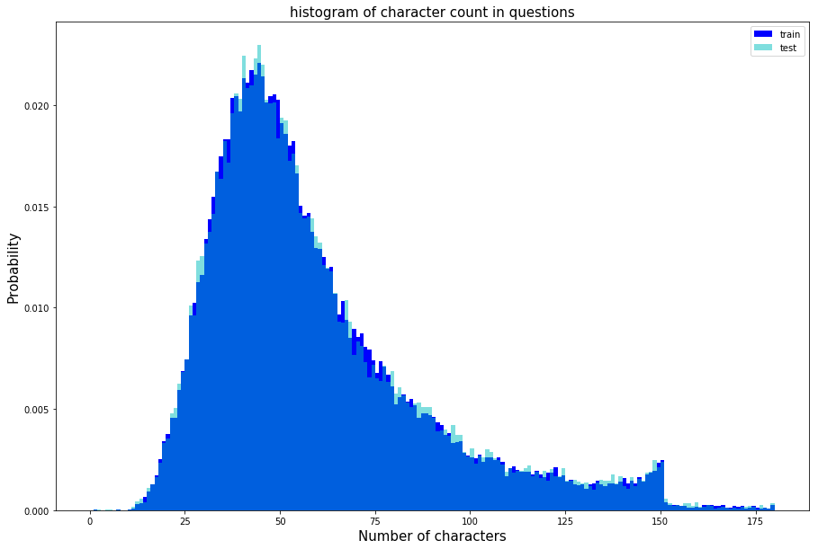
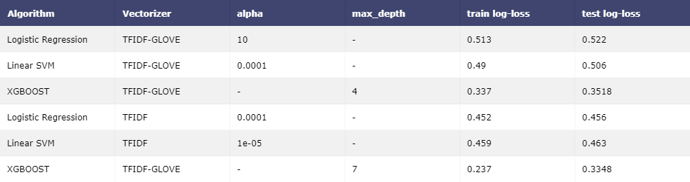

## Problem Statement
Identify which questions asked on Quora are duplicates of questions that have already been asked.
This could be useful to instantly provide answers to questions that have already been answered.
We are tasked with predicting whether a pair of questions are duplicates or not.

### Source : https://www.kaggle.com/c/quora-question-pairs 

## Real world/Business Objectives and Constraints 
- The cost of a mis-classification can be very high.
- You would want a probability of a pair of questions to be duplicates so that you can choose any threshold of choice.
- No strict latency concerns.
- Interpretability is partially important.

## Data Overview 
- Data will be in a file Train.csv 
- Train.csv contains 5 columns : qid1, qid2, question1, question2, is_duplicate 
- Size of Train.csv - 60MB 
- Number of rows in Train.csv = 404,290

  

### Performance Metric 
Source: https://www.kaggle.com/c/quora-question-pairs#evaluation

Metric(s):
log-loss 
Binary Confusion Matrix

## Exploratory Data Analysis
Distribution of data points among output classes

  

Number of occurrences of each question 
Maximum number of times a single question is repeated: 157

  

The mean of length of questions in train is: 59.6954 and test is 59.826266313315664

  

## Feature Extraction:
### 1. Basic Features:

**req_qid1** = Frequency of qid1's
 
**freq_qid2** = Frequency of qid2's
 
**q1len** = Length of q1
 
**q2len** = Length of q2
 
**q1_n_words** = Number of words in Question 1
 
**q2_n_words** = Number of words in Question 2
 
**word_Common** = (Number of common unique words in Question 1 and Question 2)
 
**word_Total** =(Total num of words in Question 1 + Total num of words in Question 2)
 
**word_share** = (word_common)/(word_Total)
 
**freq_q1+freq_q2** = sum total of frequency of qid1 and qid2
 
**freq_q1-freq_q2** = absolute difference of frequency of qid1 and qid2
 

### 2. Advanced Features:

Definition:
 
Token: You get a token by splitting sentence a space
 
Stop_Word : stop words as per NLTK.
 
Word : A token that is not a stop_word
 
Features:

**cwc_min** : Ratio of common_word_count to min lenghth of word count of Q1 and Q2 
 
**cwc_min** = common_word_count / (min(len(q1_words), len(q2_words))

**cwc_max** : Ratio of common_word_count to max lenghth of word count of Q1 and Q2
 
**cwc_max** = common_word_count / (max(len(q1_words), len(q2_words))

**csc_min** : Ratio of common_stop_count to min lenghth of stop count of Q1 and Q2 
 
**csc_min**= common_stop_count / (min(len(q1_stops), len(q2_stops))

**csc_max** : Ratio of common_stop_count to max lenghth of stop count of Q1 and Q2
 
**csc_max** = common_stop_count / (max(len(q1_stops), len(q2_stops))

**ctc_min** : Ratio of common_token_count to min lenghth of token count of Q1 and Q2
 
**ctc_min** = common_token_count / (min(len(q1_tokens), len(q2_tokens))

**ctc_max** : Ratio of common_token_count to max lenghth of token count of Q1 and Q2
 
**ctc_max** = common_token_count / (max(len(q1_tokens), len(q2_tokens))

**last_word_eq** : Check if First word of both questions is equal or not
 
**last_word_eq** = int(q1_tokens[-1] == q2_tokens[-1])

**first_word_eq** : Check if First word of both questions is equal or not
 
**first_word_eq** = int(q1_tokens[0] == q2_tokens[0])

**abs_len_diff** : Abs. length difference
 
**abs_len_diff** = abs(len(q1_tokens) - len(q2_tokens))

**mean_len** : Average Token Length of both Questions
 
**mean_len** = (len(q1_tokens) + len(q2_tokens))/2

**fuzz_ratio** : https://github.com/seatgeek/fuzzywuzzy#usage http://chairnerd.seatgeek.com/fuzzywuzzy-fuzzy-string-matching-in-python/
 
**fuzz_partial_ratio** : https://github.com/seatgeek/fuzzywuzzy#usage http://chairnerd.seatgeek.com/fuzzywuzzy-fuzzy-string-matching-in-python/
 
**token_sort_ratio** : https://github.com/seatgeek/fuzzywuzzy#usage http://chairnerd.seatgeek.com/fuzzywuzzy-fuzzy-string-matching-in-python/
 
**token_set_ratio** : https://github.com/seatgeek/fuzzywuzzy#usage http://chairnerd.seatgeek.com/fuzzywuzzy-fuzzy-string-matching-in-python/

**longest_substr_ratio**: Ratio of length longest common substring to min lenghth of token count of Q1 and Q2
 
**longest_substr_ratio**= len(longest common substring) / (min(len(q1_tokens), len(q2_tokens))

We Featurize using TFIDF weighted word2vec and BoW

## Machine Learning Models:

We split the data into train and test set in 70:30 ratio

### Random model
We randomly generate the output to find the worst case log loss and then compare it to other models.

### Logistic Regression
We also know that LR works well with high dimension data and it is also interpretable.Since we are using log loss as a metric and LR also penalises log loss. So we applied the training data to the model and used the CV data for finding best hyper-parameter (lambda).

### Linear SVM
We used Linear SVM because it is interpretable and works very well with high dimension data. RBF Kernel SVM is not interpretable so we not used it . Now we applied the training data to the model and used the CV data for finding best hyper-parameter (C)
With the best C we fitted the model and test data is applied to the model and found out the log-loss value is 0.46

### XGBOOST
Xgboost performs very well on large data and are also interpretable. They outperform other linear model. We get a test log loss of 0.334

## Results

  

## To run locally
run app.py and open localhost:8080/index

  

